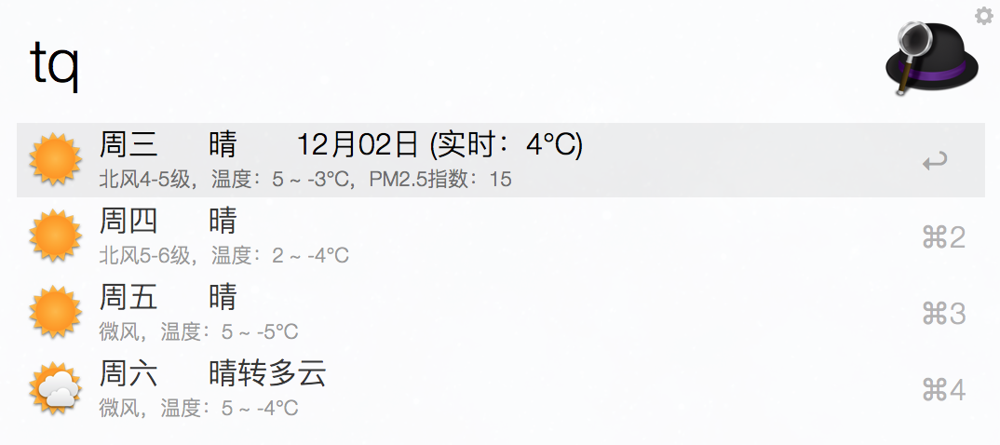
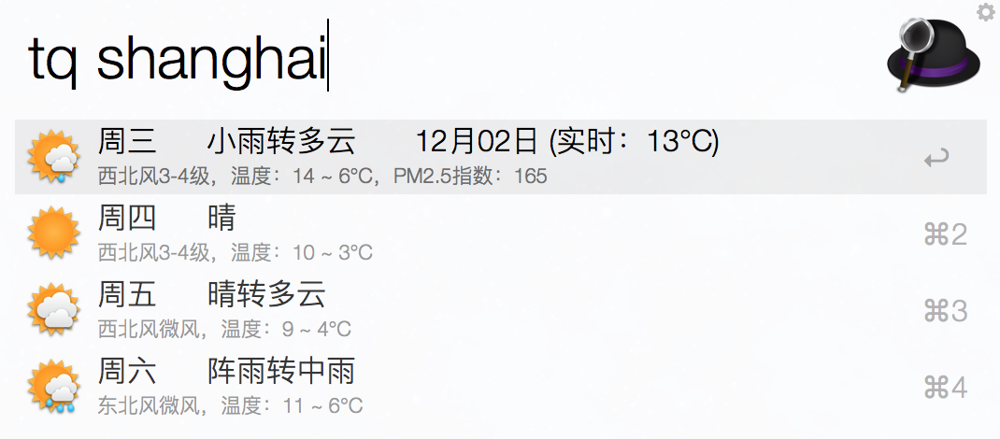

weather-workflow
================

Weather forecast workflow using Baidu API

  

感谢原作者、百度车联网和图标作者做的贡献！

### 分支更新说明

* 更新图标显示。新图标来自[橘色天气预报PNG图标 - 懒人图库](http://www.lanrentuku.com/png/1522.html)
* `tq` 默认为北京，可以自行修改
* `tq shanghai`或者`tq 上海`来显示上海天气
* 显示实时气温和PM2.5指数

### 原项目

基于[@wensonsmith的Baidu Weather](https://github.com/wensonsmith/weather-workflow)创建，更新了图标显示。
